# iris_detector

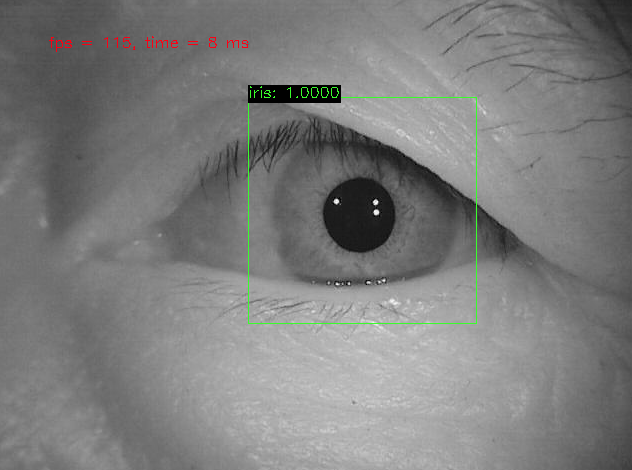

## How to train iris detector

See [how_to_train_iris_detector_with_caffe_ssd.md](./how_to_train_iris_detector_with_caffe_ssd.md)

## Network design

### ResNet10-SSD
Using 4 residual modules as base network, then add SSD's extra layers.

**Visualization of network structure (tools from ethereon)**
http://ethereon.github.io/netscope/#/gist/bc73857987941a56bc45bf4c4ae870b0

### ResNet10-SSD with half filter number
The structure is same as ResNet10-SSD except its filter number. When filter number is larger than 32, reduce it by half.

**Visualization of network structure (tools from ethereon)**
http://ethereon.github.io/netscope/#/gist/cf4dccec1f9a6c8f3f125000cd7b97f9

### MobileNet-SSD

See https://github.com/chuanqi305/MobileNet-SSD

**Visualization of network structure (tools from ethereon)**
http://ethereon.github.io/netscope/#/gist/e1e8c3c3a450f0502ef8ff6547d5dedb

## Experiment

Our iris dataset has 12800 training samples and 3200 test samples. Training on GTX1080Ti. Evaluate on Intel i5 CPU and GTX1080Ti GPU.

**Speed test**
ResNet10+SSD(half) is faster than others.
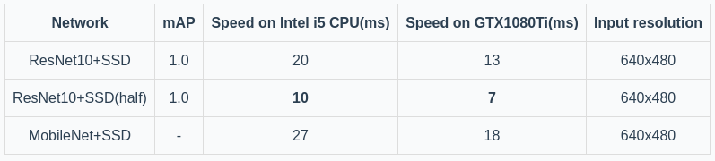

| Network      |   mAP  |  Speed on Intel i5 CPU(ms)   | Speed on GTX1080Ti(ms) | Input resolution |
| :--------: | :--------:| :------: |:--------: | :--------:| :------: | 
| ResNet10+SSD    |   1.0  |		20    | 13|	640x480 | 
| ResNet10+SSD(half)  |   1.0  |		**10**    |	**7** |	640x480 | 
| MobileNet+SSD    |    - | 27    | 18    |	640x480 | 

### ResNet10-SSD

#### Training
When set confidence threshold to 0.5 and set IoU threshold to 0.5, the accuracy is 100%.

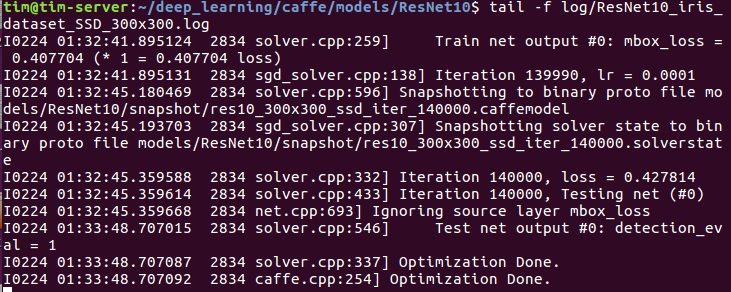

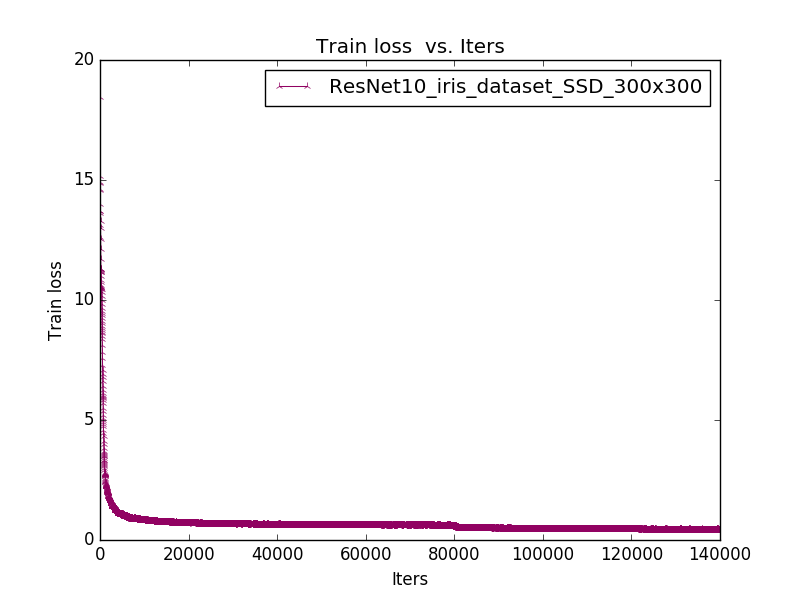

#### Evaluation
On Intel i5 CPU, the average inference time is **20ms**. On GTX1080Ti GPU, the average inference time is **13ms**. 

**Intel i5 CPU**

- evaluate by opencv3.4 Python API:
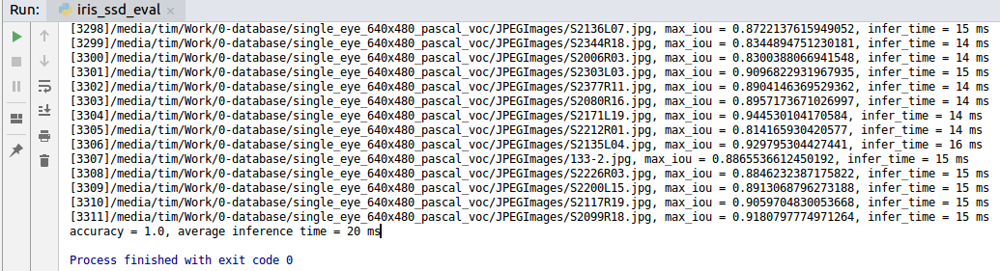

- evaluate by opencv3.4 C++ API:
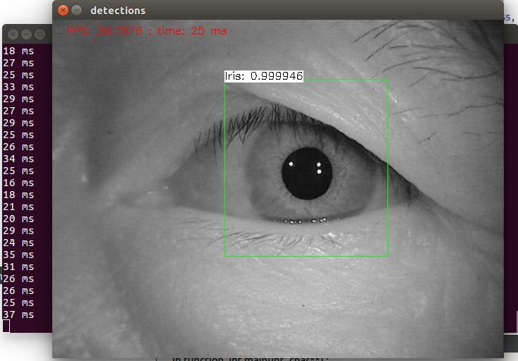

**GTX1080Ti GPU**

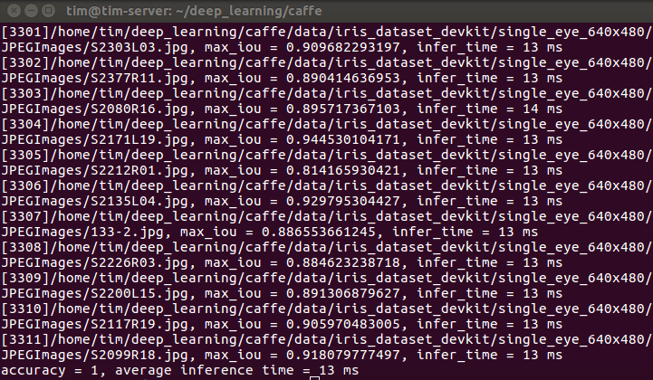

### ResNet10-SSD with half filter number

#### Training

When set confidence threshold to 0.5 and set IoU threshold to 0.5, the accuracy is 100%.

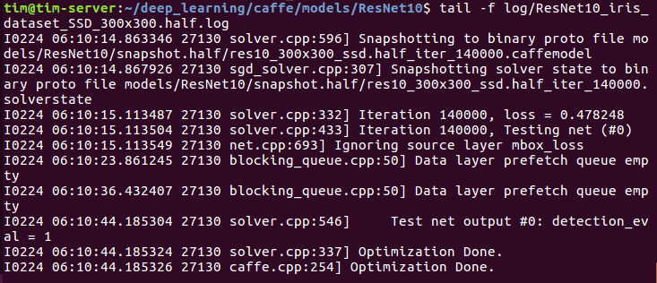

#### Evaluation
On Intel i5 CPU, the average inference time is **10ms**. On GTX1080Ti GPU, the average inference time is **7ms**. 

**Intel i5 CPU**

evaluate by opencv3.4 Python API:
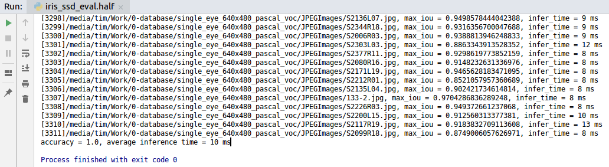

evaluate by opencv3.4 C++ API:
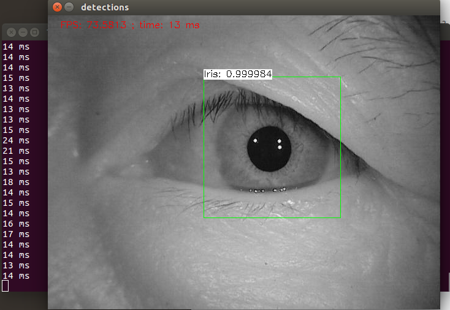

**GTX1080Ti GPU**

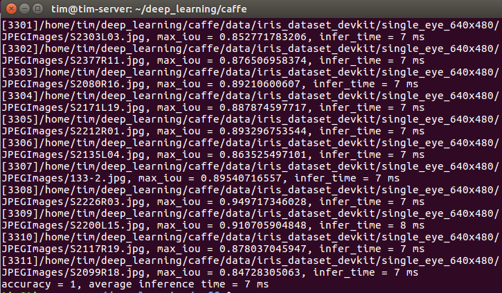

### MobileNet-SSD

#### Evaluation
We just evaluate mobilenet_300x300_ssd_iter_3000.caffemodel.  On Intel i5 CPU, the average inference time is **27ms**. On GTX1080Ti GPU, the average inference time is **18ms**.  The speed is slower than ResNet10-SSD which has high accurracy on iris dataset, so we stop training.

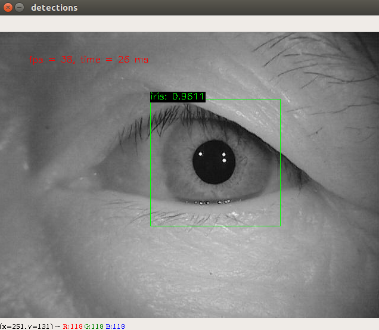

## Questions
Please contact timlee.zh@gmail.com

